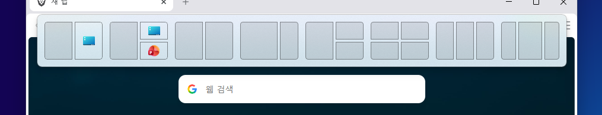
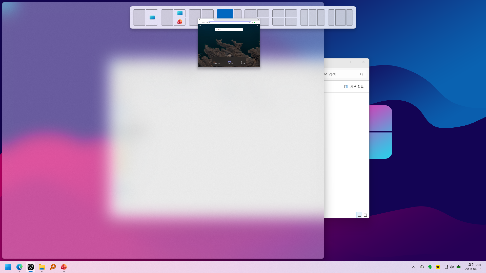
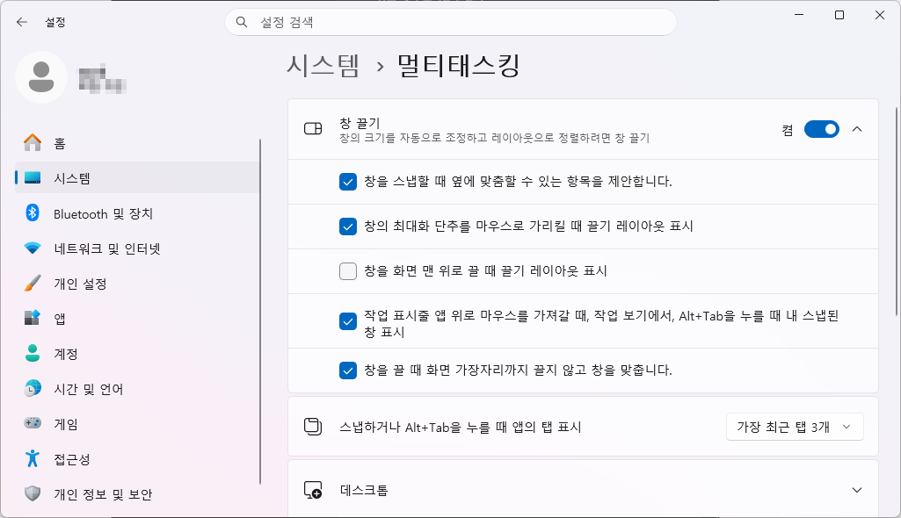
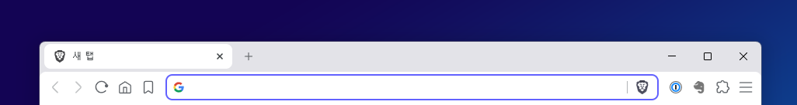

윈도우11을 사용하다 보면 창을 화면 위쪽으로 옮길 때 자동으로 **스냅(끌기) 레이아웃**이 표시되는 경우가 있습니다.

여러 창을 나누어 배치할 수 있는 기능이라 잘 활용하면 편리하지만, 단순히 창 위치만 옮기고 싶은데 매번 화면 상단에 레이아웃이 뜨면 오히려 불편하게 느껴질 수 있습니다.

저도 창을 정리하거나 프로그램 위치를 옮길 때마다 상단에 스냅 레이아웃이 표시되는 것이 거슬려서 해당 옵션을 해제했습니다.

이번 글에서는 **윈도우11에서 창 끌기 시 화면 상단에 뜨는 스냅 레이아웃을 해제하는 방법**을 정리해보겠습니다.

---

## 1. 창을 옮길 때 뜨는 스냅 레이아웃

윈도우11의 스냅 레이아웃은 창을 화면의 특정 위치로 끌어다 놓으면 자동으로 창 배치를 도와주는 기능입니다.

예를 들어 창을 화면 상단으로 드래그하면 아래처럼 여러 개의 레이아웃 선택 화면이 표시됩니다.

창을 여러 개 띄워놓고 작업할 때는 유용하지만, 창을 단순히 이동하는 과정에서도 계속 표시되면 불편할 수 있습니다.

특히 창을 화면 위쪽으로 잠깐 옮기려는 상황에서도 레이아웃이 자동으로 나타나기 때문에, 자주 창을 이동하는 사용자라면 거슬리게 느껴질 수 있습니다.

---

## 2. 윈도우11 스냅 레이아웃 해제

스냅 레이아웃은 윈도우 설정에서 간단하게 해제할 수 있습니다.

먼저 키보드에서 `Win + I`를 눌러 **설정**을 실행합니다.

그다음 아래 경로로 이동합니다.

> 윈도우 설정 > 시스템 > 멀티태스킹

멀티태스킹 화면으로 이동하면 **창 끌기** 항목을 확인할 수 있습니다.

여기서 창 끌기 기능 전체를 끌 수도 있지만, 창 정렬 기능 자체는 유지하면서 화면 상단에 뜨는 레이아웃만 해제하려면 세부 옵션을 펼쳐야 합니다.

**창 끌기** 항목 오른쪽의 화살표를 누른 뒤, 아래 옵션의 체크를 해제합니다.

> 창을 화면 맨 위로 끌 때 끌기 레이아웃 표시

이 옵션을 해제하면 창을 화면 상단으로 이동해도 더 이상 스냅 레이아웃이 자동으로 표시되지 않습니다.

---

## 3. 설정 변경 후 달라지는 점

설정을 변경한 뒤 다시 창을 화면 위쪽으로 드래그해보면 이전처럼 상단에 레이아웃 선택 화면이 나타나지 않습니다.

다만 이 설정은 스냅 기능 전체를 끄는 것이 아닙니다.

예를 들어 창을 화면 왼쪽이나 오른쪽 끝으로 가져가면 기존처럼 창을 반으로 나누어 배치하는 기능은 계속 사용할 수 있습니다.

즉, 창 정렬 기능은 유지하면서 **화면 상단에 자동으로 뜨는 끌기 레이아웃만 끄는 방식**입니다.

---

## 4. 스냅 기능 전체를 끄고 싶다면?

스냅 레이아웃뿐만 아니라 창을 화면 가장자리로 가져갔을 때 자동으로 정렬되는 기능 자체가 불편하다면 **창 끌기** 기능을 완전히 끌 수도 있습니다.

경로는 동일합니다.

> 설정 > 시스템 > 멀티태스킹 > 창 끌기

여기서 **창 끌기** 항목 자체를 끄면 창을 화면 가장자리로 이동해도 자동 정렬 기능이 동작하지 않습니다.

다만 이 경우 창을 좌우로 나누어 배치하는 기능까지 함께 꺼지기 때문에, 개인적으로는 전체 기능을 끄기보다는 아래 옵션만 해제하는 것을 추천합니다.

> 창을 화면 맨 위로 끌 때 끌기 레이아웃 표시

이렇게 설정하면 필요한 창 정렬 기능은 유지하면서, 창을 옮길 때마다 화면 상단에 뜨는 불필요한 레이아웃 표시만 줄일 수 있습니다.

---

## 마치며

윈도우11의 스냅 레이아웃은 여러 창을 효율적으로 배치할 수 있는 편리한 기능입니다.

하지만 창을 옮길 때마다 화면 상단에 레이아웃이 표시되는 것이 불편하다면 설정에서 간단히 해제할 수 있습니다.

특히 스냅 기능 전체를 끄지 않고 상단 레이아웃 표시만 끌 수 있기 때문에, 창 정렬 기능은 그대로 사용하면서 불필요한 표시만 줄이고 싶은 분들에게 유용한 설정입니다.