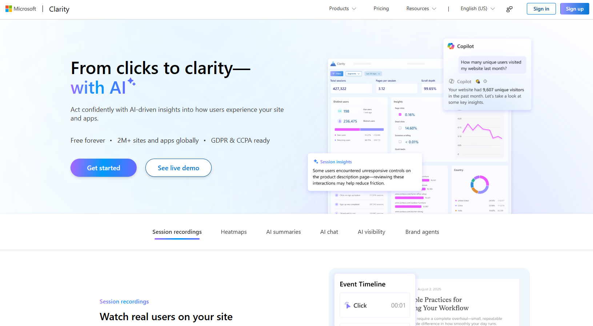
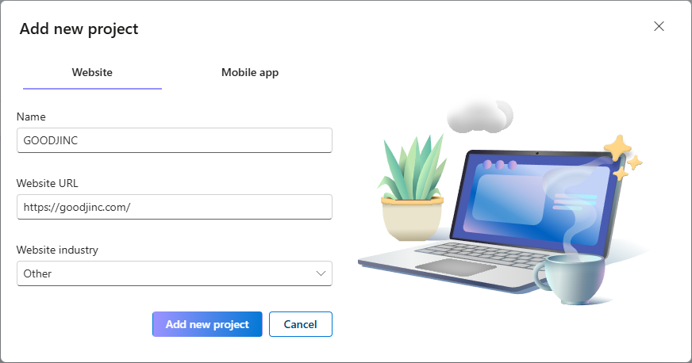
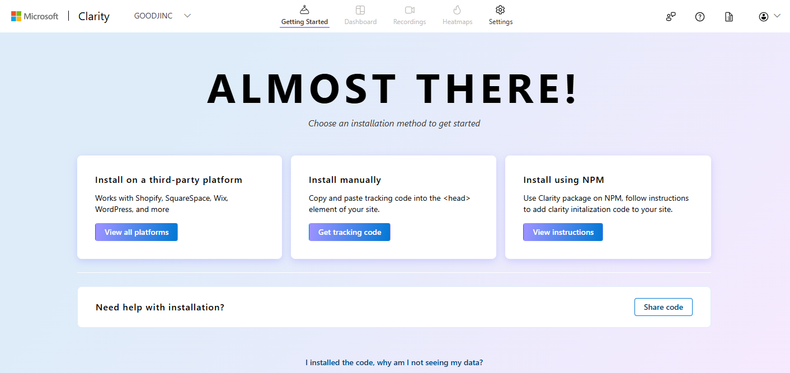
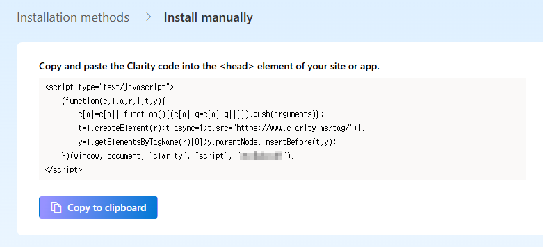
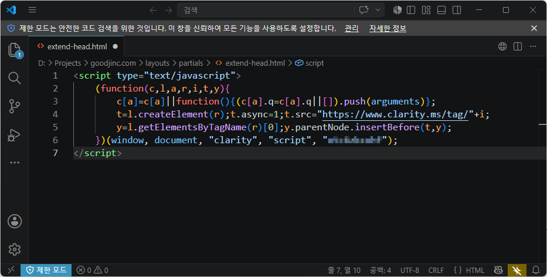
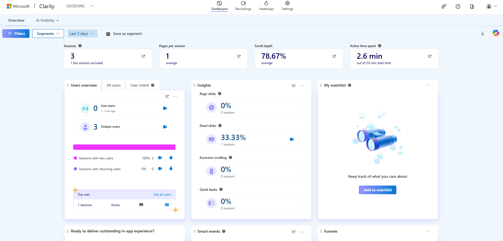

When running a blog, you may want to know more than just how many people visit. You might also wonder **which posts they read, where they click, and where they leave the page**.

Google Analytics is useful for tracking metrics such as visitor counts and traffic sources. [Microsoft Clarity](https://clarity.microsoft.com/), on the other hand, helps you see how visitors actually interact with your site.

In this post, I will briefly introduce the main features and benefits of Microsoft Clarity and show you how to add it to a Hugo blog using the Blowfish theme.

---

## 1. What Is Microsoft Clarity?

Microsoft Clarity is a free behavioral analytics tool that helps you understand how visitors use your website. Its main features include:

- **Session recordings**: Replay how visitors navigate and click through your site.
- **Heatmaps**: Visualize where visitors click and how far they scroll.
- **Dashboard**: Review visitor devices, traffic sources, popular pages, and other key information.
- **AI summaries**: Summarize important patterns and potential improvements found in the collected behavioral data.

Its biggest advantage is that it shows **how visitors use your blog**, rather than simply reporting how many people visited.



---

## 2. Why Use Clarity?

Clarity provides real visitor behavior that you can use to improve both your content and your site's usability.

- See how far visitors read through a post.
- Find links and buttons that receive frequent clicks.
- Identify elements that receive no clicks or navigation paths that cause friction.
- Compare usage patterns between desktop and mobile visitors.

For example, if most visitors leave halfway through a post, you may want to make the content more concise. If a particular link receives many clicks, you could make related posts or navigation items easier to find.

---

## 3. Create a Clarity Project

First, create a project in Clarity for your blog.

1. Go to [Microsoft Clarity](https://clarity.microsoft.com/) and sign in.
2. Select **New project**.
3. Enter a project name and your blog URL.



4. After creating the project, go to **Getting Started** and select **Install manually > Get tracking code**.



5. Select **Copy to clipboard** to copy the code.



Each project has a unique tracking code, so make sure you use the code generated for your project.

---

## 4. Add the Tracking Code to Blowfish

The Clarity tracking code must be added to the `<head>` section of your website.

Blowfish lets you add code to the `<head>` section through a separate file. Create the following file in your blog project:

```text
layouts/partials/extend-head.html
```

Paste the tracking code you copied from Clarity into this file.

```html
<!-- Microsoft Clarity -->
<script type="text/javascript">
  (function(c,l,a,r,i,t,y){
    c[a]=c[a]||function(){(c[a].q=c[a].q||[]).push(arguments)};
    t=l.createElement(r);t.async=1;t.src="https://www.clarity.ms/tag/"+i;
    y=l.getElementsByTagName(r)[0];y.parentNode.insertBefore(t,y);
  })(window, document, "clarity", "script", "YOUR_PROJECT_ID");
</script>
```

Replace `YOUR_PROJECT_ID` in the example with your actual project ID. The safest approach is to paste the entire code snippet copied directly from Clarity instead of editing the example manually.

You do not need to modify any files inside the theme itself. Using `layouts/partials/extend-head.html` in your project also makes it easier to keep the setting when you update the theme.

For more details, see the official [Blowfish Head and Footer documentation](https://blowfish.page/docs/partials/#head-and-footer).



---

## 5. Verify the Installation

After saving the file, deploy your blog and browse through a few pages. Try clicking links and scrolling through a post.

Then open your Clarity project and check the dashboard or the **Recordings** section to confirm that data is being collected. If nothing appears immediately, wait a little while and check again.

For a more direct check, open your browser's developer tools, go to the **Network** tab, search for `collect`, and confirm that requests are being sent to `clarity.ms/collect`.



---

## Before You Enable Clarity

Clarity analyzes visitor behavior and can use cookies, so check whether your blog requires a privacy policy or cookie consent mechanism. This is especially important if your blog receives visitors from other countries.

Microsoft states that sensitive content is masked by default. Even so, it is a good idea to review actual session recordings and make sure they do not reveal any unintended information.

---

## Conclusion

Microsoft Clarity helps you understand clicks, scrolling, and drop-off behavior that visitor counts alone cannot show.

With Hugo and Blowfish, the setup is straightforward because you only need to add an `extend-head.html` file. Once enough data has been collected, I plan to use heatmaps and session recordings to gradually improve the structure of my posts and the blog's navigation.

## References

- [Microsoft Clarity official website](https://clarity.microsoft.com/)
- [Microsoft Clarity installation guide](https://learn.microsoft.com/en-us/clarity/setup-and-installation/clarity-setup)
- [Blowfish Head and Footer configuration](https://blowfish.page/docs/partials/#head-and-footer)
