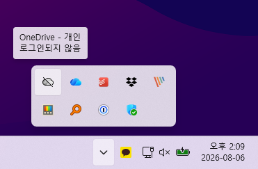

개인 도메인 메일과 MS 오피스 프로그램을 사용하기 위해 Microsoft 365 Business Standard를 구독하고 있습니다.

윈도우에는 개인 Microsoft 계정으로 로그인하고, MS Office와 OneDrive에는 Microsoft 365 비즈니스 계정을 연결해 사용하고 있습니다.

그런데 개인용 계정 원드라이브(OneDrive) 설정에서 **이 PC 연결 해제**를 선택해도 컴퓨터를 다시 시작하면 개인용 OneDrive가 비즈니스용 OneDrive와 함께 표시되고 로그인 안내가 계속 나타났습니다.

OneDrive 프로그램을 시작 앱에서 끄면 회사 OneDrive도 윈도우 로그인 시 자동으로 시작되지 않습니다. 이번 글에서는 **회사 또는 학교 OneDrive는 그대로 두고 개인용 OneDrive만 차단하는 방법**을 정리해보겠습니다.

---

## 개인용 OneDrive 로그인 안내가 계속 나타나는 이유

윈도우에 개인 Microsoft 계정이 등록되어 있으면 OneDrive가 해당 계정을 감지해 로그인 안내를 표시할 수 있습니다.

따라서 OneDrive에서 계정 연결을 해제한 뒤에도 아래와 같이 **OneDrive - 개인** 아이콘이 다시 나타날 수 있습니다.



이 문제를 해결하려면 다음 두 가지를 함께 설정해야 합니다.

- 개인 Microsoft 계정으로 OneDrive를 동기화하지 못하도록 차단
- 윈도우에 등록된 개인 계정을 감지해 로그인 안내를 표시하지 않도록 설정

---

## 시작 앱에서 OneDrive 전체를 끄지 않은 이유

개인용 OneDrive와 업무용 OneDrive는 별도의 프로그램이 아니라 같은 `OneDrive.exe`를 사용합니다.

작업 관리자의 **시작 앱**에서 OneDrive를 사용 안 함으로 변경하면 개인용 계정뿐 아니라 회사 OneDrive도 자동으로 시작되지 않습니다.

회사 OneDrive 동기화는 유지해야 한다면 시작 앱을 끄는 대신 개인 계정에만 적용되는 정책을 사용하는 것이 좋습니다.

---

## 개인용 OneDrive만 차단하기

> 레지스트리 설정을 잘못 변경하면 윈도우나 프로그램이 정상적으로 동작하지 않을 수 있습니다. 아래 명령어를 그대로 입력하고 다른 값은 변경하지 마세요.

먼저 시작 버튼을 마우스 오른쪽 버튼으로 클릭한 뒤 **터미널(관리자)**을 실행합니다.

사용자 계정 컨트롤 창이 나타나면 **예**를 선택합니다. 그다음 아래 명령어를 한 줄씩 입력합니다.

```powershell
reg add "HKCU\SOFTWARE\Policies\Microsoft\OneDrive" /v DisablePersonalSync /t REG_DWORD /d 1 /f
reg add "HKLM\SOFTWARE\Policies\Microsoft\OneDrive" /v DisableNewAccountDetection /t REG_DWORD /d 1 /f
```

각 명령어의 역할은 다음과 같습니다.

- `DisablePersonalSync`: 개인 Microsoft 계정으로 OneDrive를 설정하거나 동기화하지 못하도록 차단합니다.
- `DisableNewAccountDetection`: 개인 Microsoft 계정을 감지해 OneDrive 로그인 안내를 표시하지 않도록 설정합니다.

두 명령어 모두 **작업을 완료했습니다**라는 메시지가 표시되면 컴퓨터를 다시 시작합니다.

처음에는 `DisablePersonalSync`만 설정했지만 개인용 OneDrive 로그인 안내가 계속 나타났습니다. 그래서 개인 계정 감지에 따른 안내를 숨기는 `DisableNewAccountDetection`도 추가했습니다.

재부팅한 뒤 개인용 OneDrive의 로그인 안내가 사라졌는지 확인하고, 회사 OneDrive에서 파일 동기화가 정상적으로 작동하는지도 확인합니다.

참고로 이 설정은 개인용 OneDrive의 동기화를 차단할 뿐, 컴퓨터에 이미 내려받은 파일을 삭제하지는 않습니다.

---

## 설정을 원래대로 되돌리기

나중에 개인용 OneDrive를 다시 사용하려면 **터미널(관리자)**을 실행하고 아래 명령어를 한 줄씩 입력합니다.

```powershell
reg delete "HKCU\SOFTWARE\Policies\Microsoft\OneDrive" /v DisablePersonalSync /f
reg delete "HKLM\SOFTWARE\Policies\Microsoft\OneDrive" /v DisableNewAccountDetection /f
```

명령어 실행이 끝나면 컴퓨터를 다시 시작합니다. 이후 OneDrive에서 개인 Microsoft 계정으로 로그인하면 동기화를 다시 설정할 수 있습니다.

---

## 마치며

개인용 OneDrive의 로그인 안내만 없애려고 시작 앱에서 OneDrive 전체를 끄면 회사 계정의 자동 동기화까지 영향을 받을 수 있습니다.

이럴 때는 `DisablePersonalSync`와 `DisableNewAccountDetection` 정책을 함께 적용하면 회사 OneDrive는 계속 사용하면서 개인용 계정의 동기화와 로그인 안내만 차단할 수 있습니다.

정책에 관한 자세한 내용은 [Microsoft OneDrive 정책 공식 문서](https://learn.microsoft.com/ko-kr/sharepoint/use-group-policy)에서 확인할 수 있습니다.
